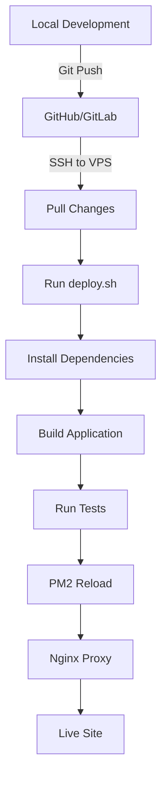

# JTH Operations Platform - Production Deployment Guide

## Table of Contents
1. [Prerequisites](#prerequisites)
2. [VPS Requirements](#vps-requirements)
3. [Initial Server Setup](#initial-server-setup)
4. [Repository Setup](#repository-setup)
5. [Database Setup](#database-setup)
6. [Application Deployment](#application-deployment)
7. [SSL Configuration](#ssl-configuration)
8. [Monitoring & Maintenance](#monitoring--maintenance)
9. [Troubleshooting](#troubleshooting)
10. [Security Checklist](#security-checklist)

## Prerequisites

### VPS Requirements
- **OS**: Ubuntu 22.04 LTS
- **RAM**: Minimum 2GB (4GB recommended)
- **CPU**: 2 vCPUs minimum
- **Storage**: 20GB minimum
- **Network**: Public IP address
- **Domain**: Configured DNS pointing to VPS IP

### Local Requirements
- Git repository access
- SSH key configured for VPS access
- Supabase project configured

## Initial Server Setup

### 1. Connect to VPS
```bash
ssh root@your-vps-ip
```

### 2. Run Initial Setup Script
```bash
# Download and run setup script
wget https://raw.githubusercontent.com/your-repo/main/deployment/setup-ubuntu.sh
sudo bash setup-ubuntu.sh
```

This script will:
- Update system packages
- Install Node.js 20.x, pnpm, PM2, Nginx
- Create application user (`jthapp`)
- Configure firewall
- Set up fail2ban for security
- Create swap space for better performance

### 3. Switch to Application User
```bash
sudo su - jthapp
```

## Repository Setup

### 1. Generate SSH Key (if needed)
```bash
ssh-keygen -t ed25519 -C "your-email@example.com"
cat ~/.ssh/id_ed25519.pub
# Add this key to your GitHub/GitLab deploy keys
```

### 2. Clone Repository
```bash
cd /var/www
git clone git@github.com:your-username/your-repo.git jth-platform
cd jth-platform
```

### 3. Set Git Configuration
```bash
git config --global user.name "Deploy Bot"
git config --global user.email "deploy@your-domain.com"
```

## Database Setup

### 1. Access Supabase Dashboard
Navigate to your Supabase project dashboard:
https://app.supabase.com/project/[your-project-id]

### 2. Run Migration Script
1. Go to SQL Editor in Supabase
2. Copy contents of `apps/web/supabase/deploy-migration.sql`
3. Execute the script
4. Verify tables are created

### 3. Configure Environment Variables
```bash
cd /var/www/jth-platform/apps/web
cp .env.production .env.local
nano .env.local
```

Update with your actual values:
```env
NEXT_PUBLIC_SUPABASE_URL=https://nsbybnsmhvviofzfgphb.supabase.co
NEXT_PUBLIC_SUPABASE_ANON_KEY=your-anon-key
SUPABASE_SERVICE_ROLE_KEY=your-service-key
NEXTAUTH_URL=https://your-domain.com
NEXTAUTH_SECRET=generate-with-openssl-rand-base64-32
NODE_ENV=production
NEXT_PUBLIC_APP_URL=https://your-domain.com
```

### 4. Verify Database Connection
```bash
cd /var/www/jth-platform/apps/web
node scripts/verify-database.js
```

## Application Deployment

### 1. Initial Deployment
```bash
cd /var/www/jth-platform
bash deployment/deploy.sh main
```

### 2. Configure Nginx
```bash
# Copy nginx configuration
sudo cp deployment/nginx.conf /etc/nginx/sites-available/jth-platform

# Update domain in nginx config
sudo nano /etc/nginx/sites-available/jth-platform
# Replace 'your-domain.com' with your actual domain

# Enable site
sudo ln -s /etc/nginx/sites-available/jth-platform /etc/nginx/sites-enabled/
sudo rm /etc/nginx/sites-enabled/default

# Test configuration
sudo nginx -t

# Reload nginx
sudo systemctl reload nginx
```

### 3. Verify Application
```bash
# Check PM2 status
pm2 status

# View logs
pm2 logs jth-web

# Test local connection
curl http://localhost:3000/api/health
```

## SSL Configuration

### 1. Install SSL Certificate
```bash
# Install certbot (if not already installed)
sudo apt-get install certbot python3-certbot-nginx

# Obtain certificate
sudo certbot --nginx -d your-domain.com -d www.your-domain.com

# Follow prompts:
# - Enter email
# - Agree to terms
# - Choose redirect option (recommended)
```

### 2. Auto-renewal Setup
```bash
# Test renewal
sudo certbot renew --dry-run

# Cron job is automatically created
sudo systemctl status snap.certbot.renew.timer
```

## Monitoring & Maintenance

### PM2 Management
```bash
# View status
pm2 status

# View logs
pm2 logs jth-web

# Restart application
pm2 restart jth-web

# Monitor CPU/Memory
pm2 monit

# Save PM2 configuration
pm2 save
```

### Log Files
- Application logs: `/var/log/jth-platform/`
- Nginx logs: `/var/log/nginx/`
- PM2 logs: `~/.pm2/logs/`

### Updates & Redeployment
```bash
# Pull latest changes and redeploy
cd /var/www/jth-platform
bash deployment/deploy.sh main
```

### Database Backup
```bash
# Manual backup (replace with your connection string)
pg_dump $DATABASE_URL > backup_$(date +%Y%m%d_%H%M%S).sql

# Set up automated backups via Supabase dashboard
```

## Troubleshooting

### Application Not Starting
```bash
# Check PM2 logs
pm2 logs jth-web --lines 100

# Check Node.js version
node --version  # Should be 20.x

# Verify environment variables
cd /var/www/jth-platform/apps/web
grep NEXT_PUBLIC_SUPABASE_URL .env.local

# Rebuild application
pnpm install --frozen-lockfile
pnpm build
pm2 restart jth-web
```

### Database Connection Issues
```bash
# Test database connection
cd /var/www/jth-platform/apps/web
node scripts/verify-database.js

# Check Supabase service status
curl https://status.supabase.com

# Verify environment variables
echo $NEXT_PUBLIC_SUPABASE_URL
```

### Nginx Issues
```bash
# Test configuration
sudo nginx -t

# Check error logs
sudo tail -f /var/log/nginx/error.log

# Restart nginx
sudo systemctl restart nginx
```

### High Memory Usage
```bash
# Check system resources
htop

# Restart PM2 with memory limit
pm2 delete jth-web
pm2 start ecosystem.config.js --max-memory-restart 1G

# Clear Next.js cache
rm -rf /var/www/jth-platform/apps/web/.next/cache
```

## Security Checklist

### Pre-deployment
- [ ] All sensitive data in environment variables
- [ ] No secrets committed to Git
- [ ] Database has proper RLS policies
- [ ] Admin routes protected by authentication

### Server Security
- [ ] SSH key authentication only (no passwords)
- [ ] Firewall configured (ufw)
- [ ] Fail2ban protecting SSH
- [ ] Regular system updates scheduled
- [ ] Non-root user for application

### Application Security
- [ ] HTTPS enforced with SSL certificate
- [ ] Security headers configured
- [ ] Rate limiting enabled
- [ ] CORS properly configured
- [ ] CSP headers set
- [ ] Input validation on all forms

### Monitoring
- [ ] PM2 monitoring active
- [ ] Log rotation configured
- [ ] Uptime monitoring service configured
- [ ] Database backups scheduled
- [ ] Error alerting set up

## Post-Deployment Checklist

1. **Functionality Tests**
   - [ ] Homepage loads correctly
   - [ ] Configurator works end-to-end
   - [ ] Quote generation successful
   - [ ] Admin panel accessible
   - [ ] Database operations working

2. **Performance Tests**
   - [ ] Page load time < 3 seconds
   - [ ] API response time < 500ms
   - [ ] Images optimized and loading

3. **Security Tests**
   - [ ] SSL certificate valid
   - [ ] Security headers present
   - [ ] Rate limiting working
   - [ ] No exposed sensitive data

4. **SEO & Analytics**
   - [ ] Robots.txt accessible
   - [ ] Sitemap.xml generated
   - [ ] Meta tags present
   - [ ] Analytics tracking (if configured)

## Support & Resources

### Quick Commands Reference
```bash
# Restart application
pm2 restart jth-web

# View logs
pm2 logs jth-web

# Pull updates
cd /var/www/jth-platform && git pull

# Rebuild and deploy
bash deployment/deploy.sh main

# Check status
pm2 status
systemctl status nginx
```

### Common Issues & Solutions

| Issue | Solution |
|-------|----------|
| 502 Bad Gateway | Check PM2 status, restart app |
| Database timeout | Check Supabase status, verify credentials |
| High CPU usage | Check for memory leaks, restart PM2 |
| SSL renewal failed | Run `sudo certbot renew` manually |
| Build failures | Clear cache, check Node version |

### Contact Information
- Technical Support: tech@your-domain.com
- Emergency Contact: +44 XXXX XXXXXX

---

## Deployment Workflow Summary



Remember to always test changes locally before deploying to production!